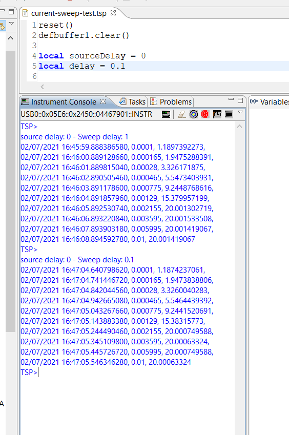
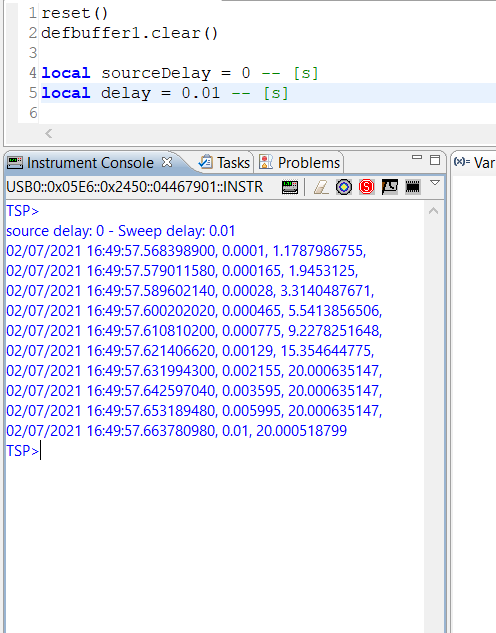
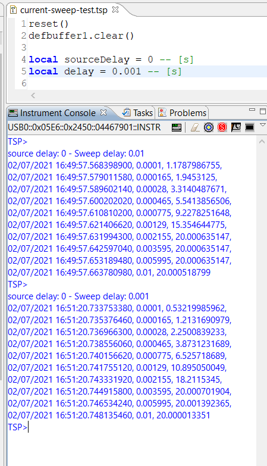
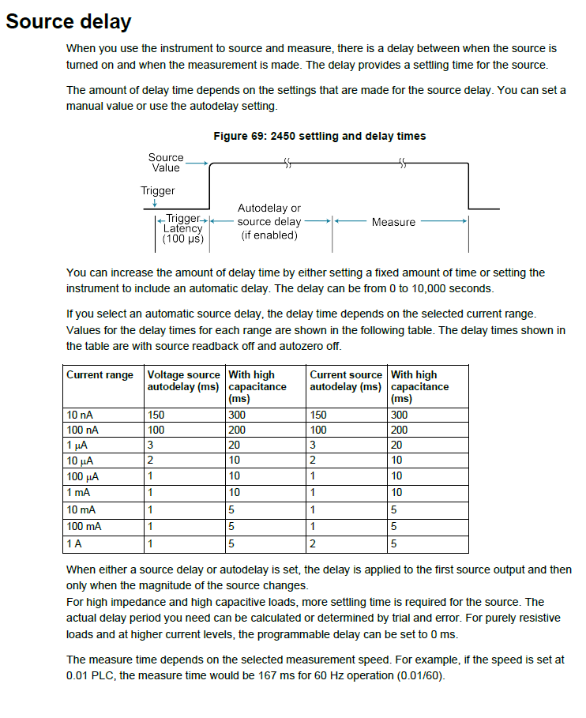

# Current Sweep Speed Test

How fast is the instrument? How many measurements can be made every second? What is the minimum time interval between two measurements?

With the [current seep test tsp script,](../current-sweep-speed-test/current-sweep-test.tsp) you can push the instrument to its maximum speed.

The time interval between two measurements is the sum of five elements: 

 1. Trigger Latency
 2. Explicit source delay or implicit source auto delay 
 3. Measure time (NPLC)
 4. Sweep delay
 5. Time consumed by the auto range and autozero functions

User-configurable parameters can influence all but trigger latency.

 The following setting configures the instrument for maximum speed:

```lua

-- setting for maximum speed 
smu.source.delay=0
smu.source.readback = smu.OFF
smu.measure.nplc = 0.01
smu.measure.autozero.enable = smu.OFF
smu.measure.autozero.once()

```

`smu.source.readback = smu.ON` mean that the output of the measure will include the measured source signal levels while with `smu.source.readback = smu.OFF` the programmed value is used. The source signal measure is executed immediately before the measure signal measurement. This additional measure requires some time and increase the overall time needed for each measurement.

`smu.source.delay=0` allow controlling the delay between two measures only with `delay` parameter `function`.

NPLC Set the amount of time that the input signal is measured. The value is expressed based on the number of power line cycles (NPLCs). Lower NPLC settings result in faster reading rates, but increased noise. Higher NPLC settings result in lower reading noise, but slower reading rates. Each power line cycle for 60 Hz is 16.67 ms (1/60); for 50Hz, it is 20 ms (1/50).

## Experimental Results

The experiment has been repeated with various combinations of NPLC and delay parameters.

- [results with 10K resistive load](../current-sweep-speed-test/current_sweep_test_R10K_LOAD.txt)
- [results with RC load](../current-sweep-speed-test/current_sweep_test_RC_LOAD.txt)



Reducing delay to 10ms (0.01s) there is some jittering on the measurement interval



When we set a 1ms delay, we get a measurement interval longer than 1ms.



## Conclusions

With Keithley 2450, the minimum time interval between two measurements is 1 and 2 ms. This is compatible with the reference manual "source delay" section of the [reference manual](https://download.tek.com/manual/2450-901-01_D_May_2015_Ref.pdf) (page 4-46)
